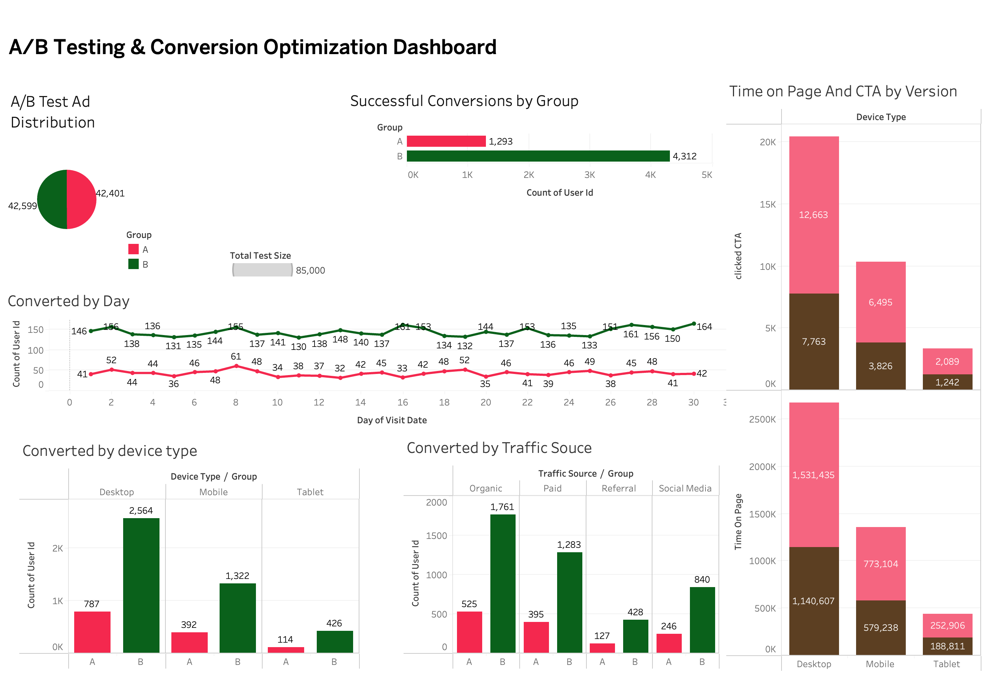

# 🧪 A/B Testing & Conversion Optimization Dashboard
## 📘 Project Overview
An interactive data visualization project that analyzes and compares the performance of two ad versions (A & B) using A/B testing. This dashboard is built to uncover insights into user conversion behavior across different device types, traffic sources, and engagement metrics.

📊 Goal: Help marketers and product teams optimize ad performance by identifying the best-performing variant and the conditions under which it performs best.

## 📊 Power BI Interactive Dashboard

[👉 Click here to view the interactive Power BI report](https://public.tableau.com/app/profile/ce.hou/viz/1_17391485467850/TestComparasion)

⚠️ This report is for portfolio demonstration purposes only and uses sample (non-sensitive) data.